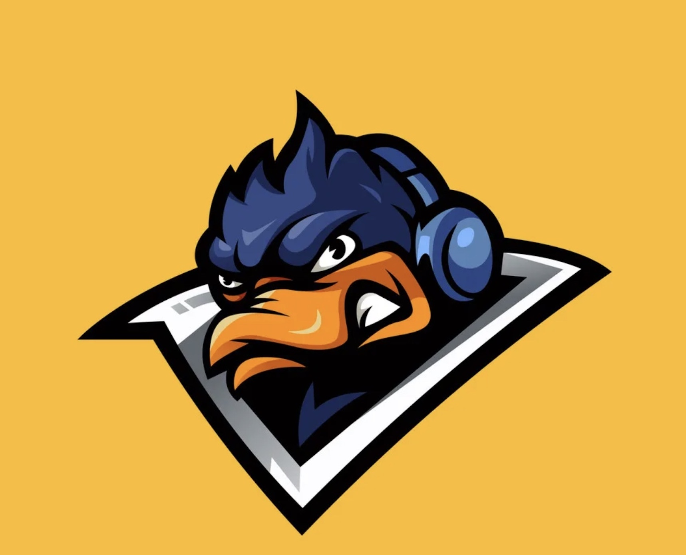

# Mutant Games

From the dev team that brought you *Duck Duck Shoe*.

Mutant Games is an open source video game lobby service! Users can create and join lobbies to connect with their friends and chat about their favorite video games.

 

## Getting Started:

Here are links to the [deployed applcation](https://www.example.com) and a [Trello Board](https://trello.com/b/K7ydDNPv/tmnt) containing planning materials.

To run the project locally:

1. Clone and initiate the [back-end repository](https://github.com/Team-Mutant/Mutant-games-back-end) (following the step-by-step setup guide in the README)

2. Navigate to the directory you want to clone this app into and run the command 

 `git clone git@github.com:Team-Mutant/Mutant-games-front-end.git`

3. After cloning the front-end project directory, run the command 

`touch .env`

4. Add the following line of code to the .env file you just created.

`REACT_APP_BACKEND_SERVER_URL=http://localhost:3001`

5. Install all dependencies by running the command 

`npm i`

6. Spin up the app by running the command 

`npm start`

 

## Screenshots:

## Technologies Used:

This full-stack MERN application was built using:

 
 
 
 
 
 
 
 
 
 
 
 

 

## Next Steps:

On the next version of Mutant Games, we are excited to introduce real-time communication via Socket.io!  We will also be implementing the ability for users to keep up with their friend's with an "Add Friend" feature.